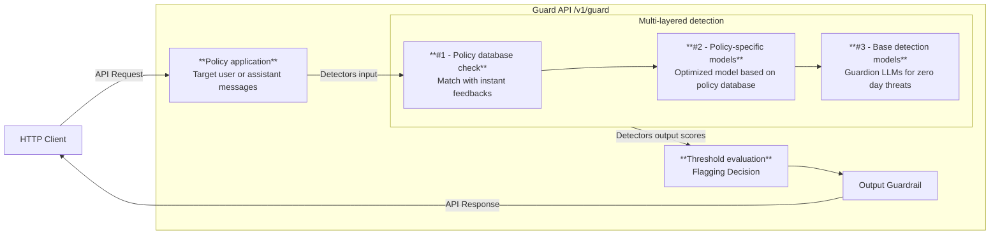

The feedback system allows you to continuously improve your AI guardrails by providing feedback on detection results. This human-in-the-loop approach helps fine-tune your detectors, reduce false positives, and enhance overall detection accuracy.

<Frame>
  
</Frame>
## How feedback works

When you provide feedback on detection results, Guardion uses this information to:

1. Build a dataset of edge cases specific to your use case
2. Immediately apply adjustments to incoming prompts and responses in the Guard API (using similarity and string match)
3. Incorporate your feedback during for the policy's models retraining

This process helps your guardrails become more accurate over time, reducing false positives while maintaining strong protection.

## Providing feedback

The feedback interface is integrated directly into the Logs section, making it easy to review and provide input as you investigate detections.

<Frame>
  
</Frame>

### Individual feedback

When reviewing a specific log entry:

1. Click on the log to view all detection details
2. For any incorrect classification, click **Mark as Misclassification**
3. Your feedback is immediately applied to the relevant policies

<Frame>
  
</Frame>

### Bulk feedback

To efficiently review multiple logs at once:

1. Select multiple log entries using the checkboxes
2. Choose one of the available actions:
   - **Mark as Misclassification** - For incorrectly classified content
   - **Confirm as Flagged** - To validate correct threat detections (available when Threat filter is enabled)

<Frame>
  
</Frame>

> **Note:** Feedback is processed individually for each policy that triggered a detection, allowing for precise improvement of specific guardrails.

## Reviewing feedback history

You can review all feedback provided for each policy:

<Frame>
  
</Frame>

The feedback history shows all previous inputs and allows you to modify them if needed. Any changes take effect immediately in the Guard API inside the feedback system.

<Frame>
  
</Frame>

## Feedback Integration with Guard API

The following diagram illustrates how the Guard API processes requests and incorporates feedback throughout the workflow:

### Detection workflow

The Guard API follows a structured evaluation process for each request:

1. **Policy application**: Each request is evaluated against your configured policies, which specify both the target (user or assistant messages) and the detection thresholds.

2. **Multi-layered detection**: The system processes each request through a cascading detection pipeline:
   - **Feedback database check**: First, we check against your policy's feedback database using exact string matching and semantic similarity algorithms
   - **Policy-specific models**: If not flagged by feedback, the request is evaluated by models specifically trained on your policy's feedback data
   - **Base detection models**: Finally, Guardion's foundation detection models evaluates the request to provide comprehensive protection

3. **Threshold evaluation**: Detection confidence scores are compared against your configured thresholds (L1-L4)
   - If the confidence score exceeds the threshold, the request is flagged
   - The API returns the flagging decision to the client with breakdown data

This layered approach ensures both performance and accuracy, with your feedback continuously improving detection quality.

## Best practices

- Provide feedback regularly to continuously improve detection accuracy
- Focus on edge cases that are specific to your use case
- Review feedback history periodically to identify patterns in misclassifications
- Use bulk actions for efficient review of similar detection types
