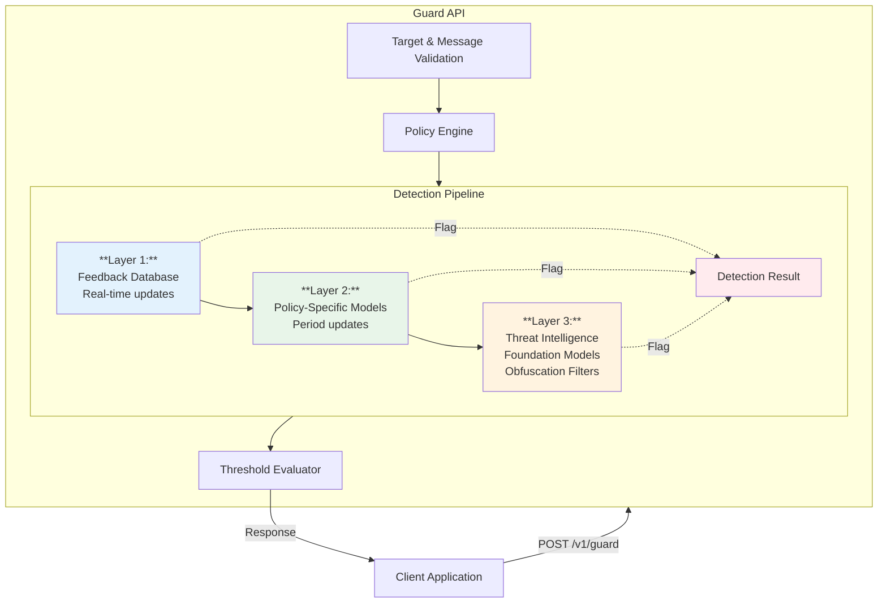

The feedback system allows you to continuously improve your AI guardrails by providing feedback on detection results. This human-in-the-loop approach helps fine-tune your detectors, reduce false positives, and enhance overall detection accuracy.

<Frame>
  
</Frame>
## How feedback works

When you provide feedback on detection results, Guardion uses this information to:

1. Build a dataset of edge cases specific to your use case
2. Immediately apply adjustments to incoming prompts and responses in the Guard API (using similarity and string match)
3. Incorporate your feedback during for the policy's models retraining

This process helps your guardrails become more accurate over time, reducing false positives while maintaining strong protection.

## Providing feedback

The feedback interface is integrated directly into the Logs section, making it easy to review and provide input as you investigate detections.

<Frame>
  
</Frame>

### Individual feedback

When reviewing a specific log entry:

1. Click on the log to view all detection details
2. For any incorrect classification, click **Mark as Misclassification**
3. Your feedback is immediately applied to the relevant policies

<Frame>
  
</Frame>

### Bulk feedback

To efficiently review multiple logs at once:

1. Select multiple log entries using the checkboxes
2. Choose one of the available actions:
   - **Mark as Misclassification** - For incorrectly classified content
   - **Confirm as Flagged** - To validate correct threat detections (available when Threat filter is enabled)

<Frame>
  
</Frame>

> **Note:** Feedback is processed individually for each policy that triggered a detection, allowing for precise improvement of specific guardrails.

## Reviewing feedback history

You can review all feedback provided for each policy:

<Frame>
  
</Frame>

The feedback history shows all previous inputs and allows you to modify them if needed. Any changes take effect immediately in the Guard API inside the feedback system.

<Frame>
  
</Frame>

## Feedback Integration with Guard API

The following diagram illustrates how the Guard API processes requests and incorporates feedback throughout the workflow:

### Detection workflow

The Guard API follows a structured evaluation process for each request:

1. **Input validation**: The API validates incoming requests and extracts messages for evaluation
2. **Policy application**: Your configured policies determine:
   - Which messages to evaluate (user, assistant, or both)
   - Detection thresholds (L1-L4)
   - Active detection layers
3. **Detection pipeline**: Each message passes through up to three detection layers
4. **Threshold evaluation**: Detection scores are compared against policy thresholds
5. **Response**: The API returns the evaluation result with detailed scoring breakdown

This layered approach ensures both performance and accuracy, with your feedback continuously improving detection quality.

### Detection layers

The Guard API uses a cascading detection pipeline that prioritizes speed and accuracy:

#### Layer 1: Feedback database
- **Method**: Exact string matching and semantic similarity
- **Speed**: < 10ms
- High-confidence detection of previously flagged content

#### Layer 2: Policy-specific models
- **Method**: Models fine-tuned on your policy's feedback data
- **Speed**: < 10ms
- Domain-specific threat detection

#### Layer 3: Threat Intelligence & Foundation models
- Comprehensive protection against zero-day threats
- **Method**: Guardion's state-of-the-art LLMs
- **Speed**: ~200ms
- Broad coverage and emerging threat detection

## Best practices

1. **Start with L2 threshold** and adjust based on your false positive tolerance
2. **Provide feedback regularly** to improve policy-specific model accuracy
3. **Monitor detection metrics** to optimize threshold configuration
4. **Use policy targeting** to evaluate only relevant message types

## Next steps

- [Configure your first policy →](./policies)
- [Submit feedback to improve detection →](./feedback)
- [View API reference →](./api-reference)